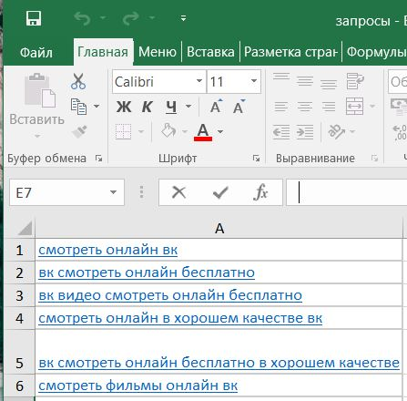
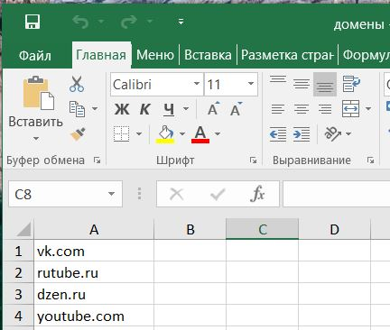
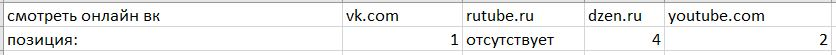

<body>
    <h1>Описание</h1>
    
Данный бот предназначен для работы с Yandex Search API и позволяет пользователю проверять позиции доменов по заданным формулировкам запросов.

    <h2>Использование</h2>
    <ol>
        <li>
            <h3>Начало работы</h3>
            
Для запуска бота использовать команду <code>/start</code>.

        </li>
        <li>
            <h3>Ввод ключа API</h3>
            
После запуска введите ваш ключ к Yandex Search API, чтобы бот мог взаимодействовать с сервисом.

        </li>
        <li>
            <h3>Ввод folderid</h3>
            
Затем введите ваш <code>folderid</code>. Бот сообщит, что и когда вводить.

        </li>
        <li>
            <h3>Добавление данных</h3>
            
Формулировки запросов и доменные имена, которые необходимо проверить, добавляются с помощью Excel-файлов. В Excel-файлах данные должны располагаться в первом столбце друг под другом.

            
Запросы:

            
            
Домены:

            
            
<strong>Примечание:</strong> Файлы могут называться как угодно, но <strong>последовательность загрузки</strong> важна. Бот сообщит, что и когда нужно загружать.

        </li>
        <li>
            <h3>Получение результатов</h3>
            
После обработки данных бот создаст файл <code>results.xlsx</code>. В этом файле будут следующие данные:

            
            
Под каждым доменом указаны его позиции в выдаче Yandex Search API. Если у домена несколько позиций, они будут перечислены. Если домен отсутствует на первой странице по запросу, под ним будет написано "отсутствует".

        </li>
        <li>
            <h3>Повторная работа с ботом</h3>
            
Для повторного запуска бота введите команду <code>/start</code>, и бот предложит это сделать.

        </li>
    </ol>
    <h2>Важно</h2>
    
В настоящее время бот считывает из файла с формулировками только первые <strong>10 строк</strong>. Это ограничение установлено в техническом задании, но его можно увеличить при необходимости.

    <h2>Установка</h2>
    
<code>git clone [ссылка на репозиторий]</code>

    
<code>docker build tg_bot .</code>

    
<code>docker run -e API_TOKEN=[секретный_токен] tg_bot</code>

  </body>
